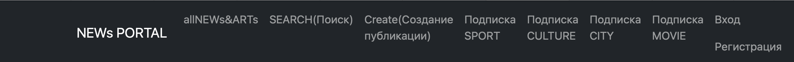
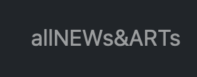
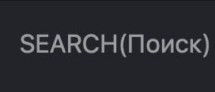
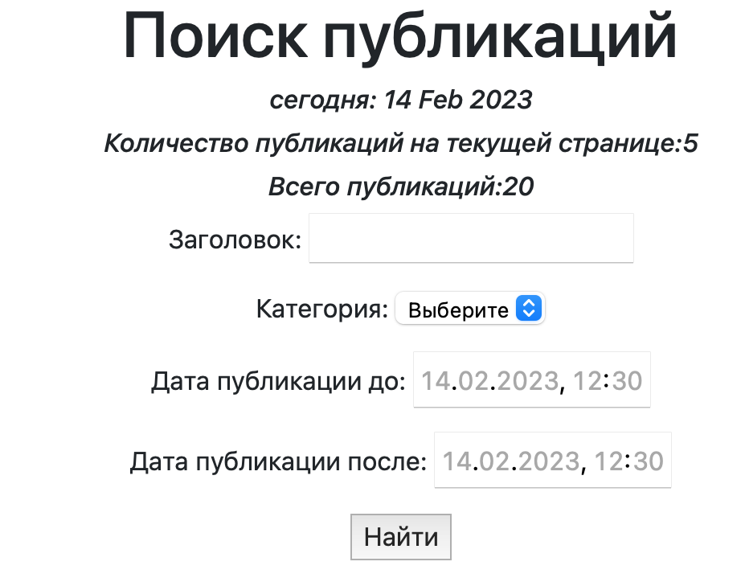
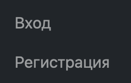
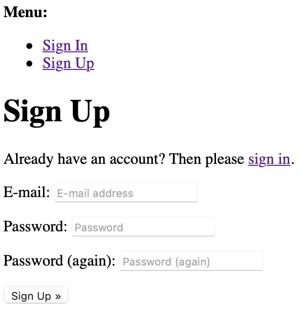
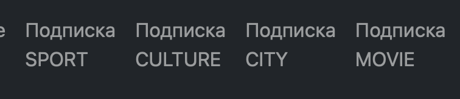
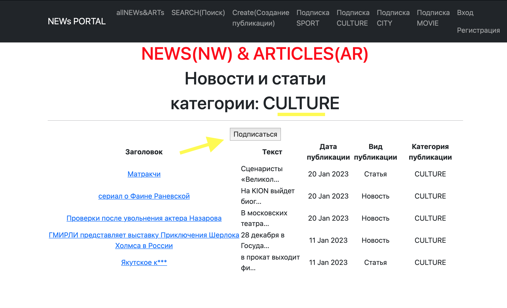

Hi, I'm **Alina** 👋

I 'm trying to become a developer . I'm trying to get into IT. 
It is a difficult path for me. But I'm not discouraged because **everything is possible** 🤞😉

My main project is [NEWsPortal](http://127.0.0.1:8003/news/) at the moment.
Let me tell you about this project


# [NEWsPortal](http://127.0.0.1:8003/news/)
### [)](https://git.io/typing-svg)

---
Project developed by:


Site structure:


I'll tell you more about the navigation buttons:

1. 
   
    Click on this button and you will see list of news and articles. Sorting by date
2. 

   You can find news by date, title, category.
   Look here:
   


3. 
   
   You can create your own news or articles! 🎉
   but it's available for only registered users.

   For Sing up you should press button:

   

   Complete this form:

   

   or if you are a registered user press [Sign IN](http://127.0.0.1:8003/accounts/login/)


4. 

   Уou can quickly subscribe to the categories of news and articles which you like by clicking on these buttons. 
   The buttons shared into categories.
   
   For example:

   


So it's the main functionality of my project at the moment. 
I'm going to refine and improve this project.

```` Thank you! 🙏 ````

___


[](https://github.com/anuraghazra/github-readme-stats)